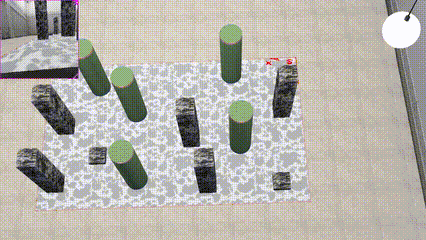

## Hi there 👋, My name is Owhenthesaints, feel free to look at my repos

<!--
**Owhenthesaints/Owhenthesaints** is a ✨ _special_ ✨ repository because its `README.md` (this file) appears on your GitHub profile.

Here are some ideas to get you started:

- 🔭 I’m currently working on ...
- 🌱 I’m currently learning ...
- 👯 I’m looking to collaborate on ...
- 🤔 I’m looking for help with ...
- 💬 Ask me about ...
- 📫 How to reach me: ...
- 😄 Pronouns: ...
- ⚡ Fun fact: ...
-->

- 🔭 I’m currently working on a 2048 ai
- 🌱 I’m currently learning Robotics, theory of computation and computer architecture, 
- 💬 Ask me about politics and world affairs and I would be glad to debate.
- 😄 Pronouns: he/him
- ⚡ Fun fact: My tongue can touch my nose (suprisingly rare from my own statistics)
- 🤔 Once I have finished my masters I will be looking for help on finding a project that link economy (post keynsian) and cryptocurrency

Here are some videos of projects I have worked on (gifs take time to load):

<table>
  <tr>
    <td></td>
    <td></td>
  </tr>
  <tr>
    <td></td>
    <td></td>
  </tr>
</table>

